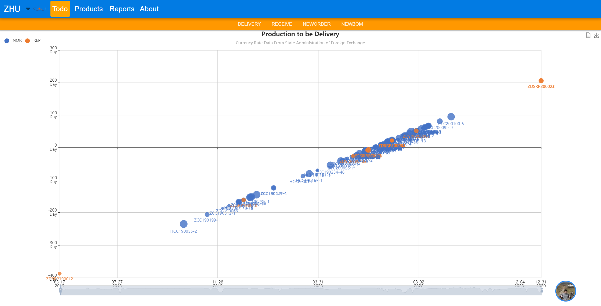
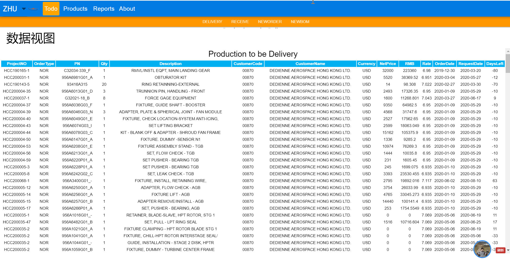
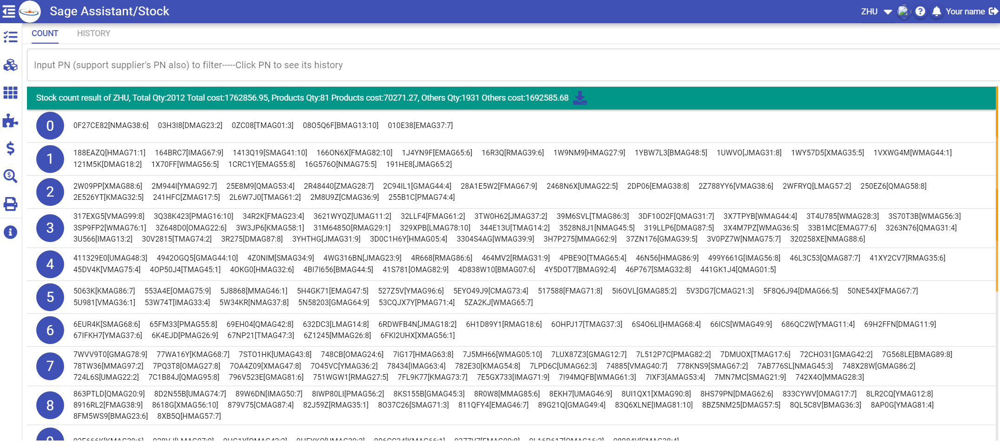
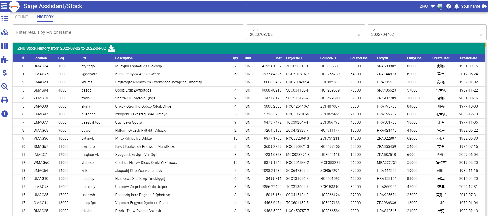
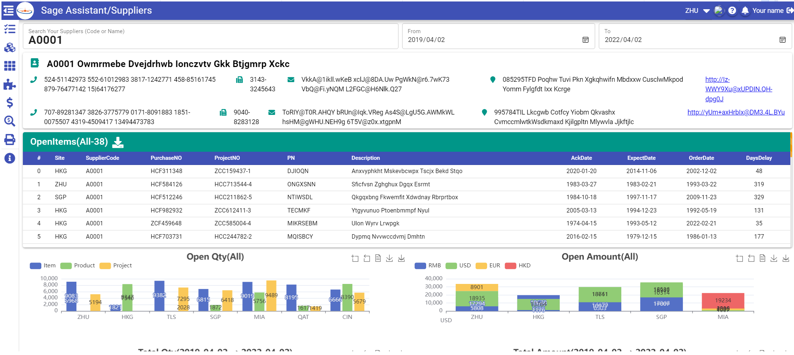
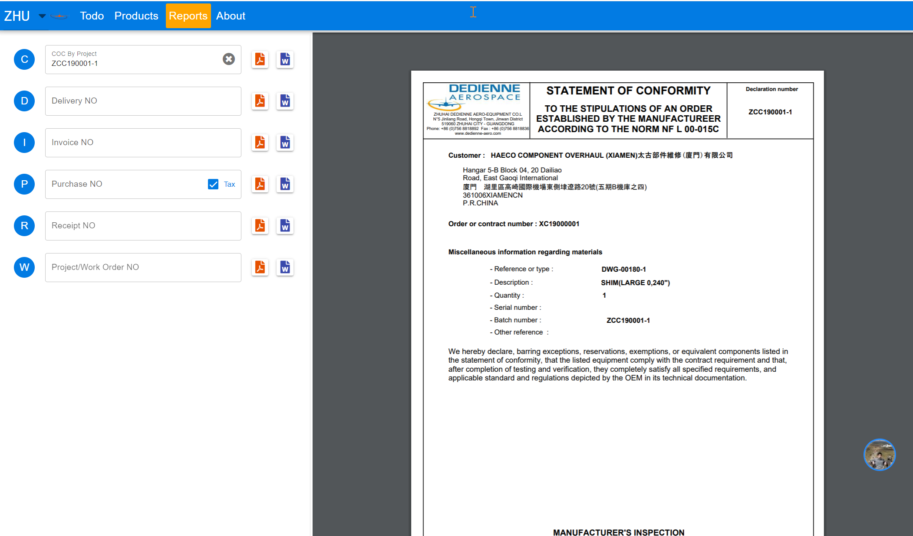

# Getting Started

### This project contains two parts 
* srv(developed with java)
* web(is developed with vue/quasar)

### Screen snap








### Server install&config
1. install Oracle Jre Environment (java 8 or later) 
  (suggest download rpm, and using ```rpm -ivh ******.rpm``` to install it)
```Crystal report doesn't support OpenJDK, it cannot found fonts when export pdf. So, please make sure you are using Oracle Jre runtime, and install the fonts first, if you plan to deploy it to Linux.```
2. install fonts as requried
3. install tomcat/nginx (tomcat 9 or later)
 (suggest download rpm, and using ```rpm -ivh ******.rpm``` to install it)
4. copy SageAssistantSrv.war to path ```tomcat-*/webapps```
5. copy web/dist/spa/* to ```nginx/html/``` 
6. mount windows share foler in linux ```mount -t cifs -o user=user,password=password //server/sharename /mnt/mnt/Manual``` ```mount -t cifs -o user=user,password=password //server/sharename /mnt/mnt/Drawing```
7. add these config to ```nginx.conf```
   ```
   location ^~ /Data/ {
       proxy_pass http://localhost:8080;
	   proxy_http_version 1.1;
	   proxy_set_header Upgrade $http_upgrade;
	   proxy_set_header Connection 'upgrade';
	   proxy_set_header Host $host;
	   proxy_cache_bypass $http_upgrade;
   }
   location ^~ /Report/ {
       proxy_pass http://localhost:8080;
	   proxy_http_version 1.1;
	   proxy_set_header Upgrade $http_upgrade;
	   proxy_set_header Connection 'upgrade';
	   proxy_set_header Host $host;
	   proxy_cache_bypass $http_upgrade;
   }
   location ^~ /File/ {
       root /mnt;
	   rewrite '^File/(.*)' /$1 break;
   }
   location ^~ /mnt/Drawing/ {
      root /mnt/Drawing;
   }   
   location ^~ /mnt/Manual/ {
      root /mnt/Manual;
   }
   ```
   
```Don't forget open you firewall to allow the http 80 port```

8. start tomcat with ```tomcat/bin/startup.sh```
9. start nginx with ```nginx -s start```
10. if use file upload function, mostly, you need change the default upload size limit both in ```nginx.conf``` 
    ```
    client_max_body_size  500m;
    proxy_connect_timeout 300s;
    proxy_send_timeout 300s;
    proxy_read_timeout 300s;
    ```
    and java app ```application.properties```
    ```
    // single file size limit
    spring.servlet.multipart.max-file-size= 500MB
    // total size limit per one request
    spring.servlet.multipart.max-request-size= 500MB
    ```
11. if chinese text can't display in pdf, please configure /ect/locale.conf
    ```LANG=zh_CN.UTF-8```