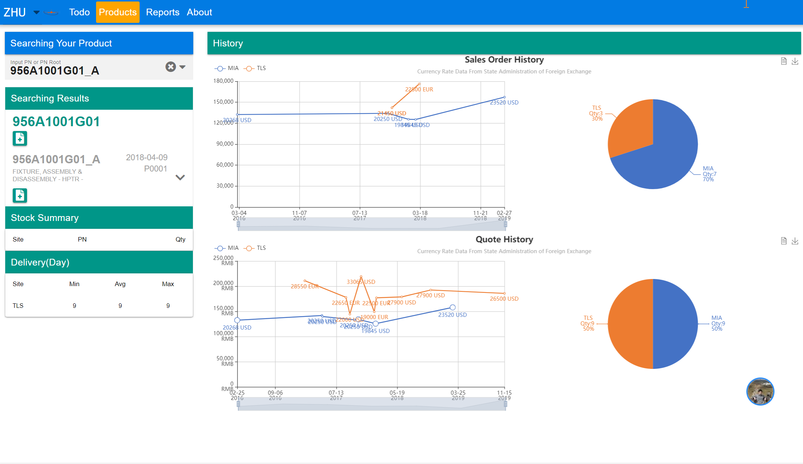

# Getting Started

### This project contains two parts 
* srv(developed with java)
* web(is developed with vue/quasar)

### Screen snap



### Server install&config
1. install Oracle Jre Environment
2. install fonts as requried

```Crystal report doesn't support OpenJDK, it cannot found fonts when export pdf. So, please make sure you are using Oracle Jre runtime, and install the fonts first, if you plan to deploy it to Linux.```

3. install tomcat/nginx
4. copy SageAssistantSrv.war to path ```tomcat-*/webapps```
5. copy web/dist/spa/* to ```nginx/html/``` 
6. mount windows share foler in linux ```mount -t cifs -o user=user,password=password //server/sharename /mnt/mnt/DOCS_METHODES```
7. add these config to ```nginx.conf```
   ```
   location ^~ /Data/ {
       proxy_pass http://localhost:8080;
	   proxy_http_version 1.1;
	   proxy_set_header Upgrade $http_upgrade;
	   proxy_set_header Connection 'upgrade';
	   proxy_set_header Host $host;
	   proxy_cache_bypass $http_upgrade;
   }
   location ^~ /Report/ {
       proxy_pass http://localhost:8080;
	   proxy_http_version 1.1;
	   proxy_set_header Upgrade $http_upgrade;
	   proxy_set_header Connection 'upgrade';
	   proxy_set_header Host $host;
	   proxy_cache_bypass $http_upgrade;
   }
   location ^~ /File/ {
       root /mnt/DOCS_METHODES;
	   rewrite '^File/(.*)' /$1 break;
   }
   location ^~ /mnt/DOCS_METHODES/ {
      root /mnt/DOCS_METHODES;
   }
   ```
   
```Don't forget open you firewall to allow the http 80 port```

8. start tomcat with ```tomcat/bin/startup.sh```
9. start nginx with ```nginx -s start```
