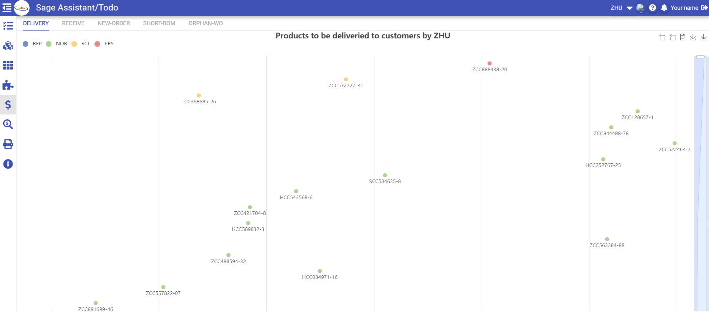

# Getting Started

### This project contains three parts

- data-srv(developed with java)
- rpt-srv(developed with java)
- web(developed with vue/quasar)

### Screen snap





### Server installation&config

#### JAVA

1. Download/Install JAVA Environment (java 17 or later).
2. Set "JAVA_HOME" and "CLASSPATH" environment variables. You can copy `java.sh` to `profile.d` folder to do it, modify the `JAVA_HOME` as required.
3. Run the command: `java -version` to check if Java is installed.

#### JAVA FONTS

1. Install report fonts as required (see `rpt-srv` README).

#### Tomcat

1. Download/Install tomcat (tomcat 10 or later).
2. Set tomcat service, you can copy `tomcat.service` to `/usr/lib/systemd/system` folder, modify the `JAVA_HOME` as required.
3. Run the command: `systemctl start tomcat` to start the tomcat.
4. Open a browser and type `http://serverIP:port` to check if tomcat works.
5. Copy `DataSrv.war;RptSrv.war` to path `tomcat-*/webapps`.

#### ShareFolder (optional)

1. mount windows share folder in linux `mount -t cifs -o user=user,password=password //server/sharename /mnt/mnt/Manual` `mount -t cifs -o user=user,password=password //server/sharename /mnt/mnt/Drawing`

#### Nginx

1. Download/Install nginx.
2. Set nginx service, you can copy `nginx.service` to `/usr/lib/systemd/system` folder.
3. Run the command: `systemctl start nginx` to start the nginx.
4. copy `web/dist/spa/\*` to `nginx/html/`
5. add these config to `nginx.conf`
   ```
   location ^~ /Data/ {
      proxy_pass http://localhost:8080/data-srv;
      proxy_http_version 1.1;
      proxy_set_header Upgrade $http_upgrade;
      proxy_set_header Connection 'upgrade';
      proxy_set_header Host $host;
      proxy_cache_bypass $http_upgrade;
   }
   location ^~ /Report/ {
      proxy_pass http://localhost:8080/rpt-srv;
      proxy_http_version 1.1;
      proxy_set_header Upgrade $http_upgrade;
      proxy_set_header Connection 'upgrade';
      proxy_set_header Host $host;
      proxy_cache_bypass $http_upgrade;
   }
   location ^~ /File/ {
       root /mnt;
      rewrite '^File/(.*)' /$1 break;
   }
   location ^~ /mnt/Drawing/ {
      root /mnt/Drawing;
   }
   location ^~ /mnt/Manual/ {
      root /mnt/Manual;
   }
   ```

> Note: Don't forget open you firewall to allow the http 80 port

6. if use file upload function, mostly, you need change the default upload size limit both in `nginx.conf`
   ```
   client_max_body_size  500m;
   proxy_connect_timeout 300s;
   proxy_send_timeout 300s;
   proxy_read_timeout 300s;
   ```
   and java app `application.properties`
   ```
   // single file size limit
   spring.servlet.multipart.max-file-size= 500MB
   // total size limit per one request
   spring.servlet.multipart.max-request-size= 500MB
   ```
